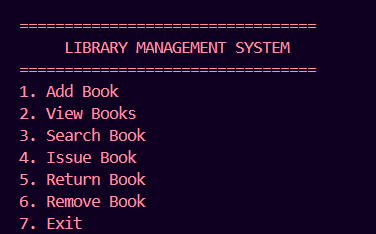
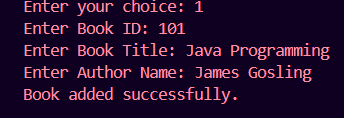
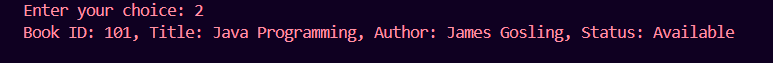
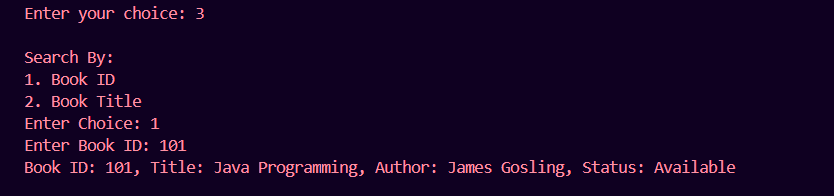
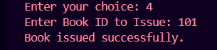
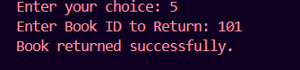

# Library Management System

## Project Overview

This is a console-based Library Management System developed as part of the WeIntern Java Developer Internship.

The application allows users to manage library books efficiently through a menu-driven interface. Users can add books, search books, issue books, return books, remove books, and view all available books.

The project demonstrates the use of Java OOP concepts, Collections Framework, Encapsulation, Constructors, and Input Validation.

---

# Features

✅ Add New Book

✅ View All Books

✅ Search Book by ID

✅ Search Book by Title

✅ Issue Book

✅ Return Book

✅ Remove Book

✅ Menu-Driven Console Application

✅ Collection Framework (ArrayList)

✅ Encapsulation and OOP Principles

---

# Technologies Used

- Java
- ArrayList
- Object-Oriented Programming (OOP)
- Encapsulation
- VS Code
- Git & GitHub

---

# Project Structure

```text
Task3_LibraryManagementSystem/
│
├── images/
│   ├── menu.png
│   ├── add-book.png
│   ├── view-book.png
│   ├── search-book.png
│   ├── issue-book.png
│   └── return-book.png
│
├── Book.java
├── Library.java
├── Main.java
└── README.md
```

---

# How to Run

## Step 1: Compile the Java Files

```bash
javac *.java
```

## Step 2: Run the Application

```bash
java Main
```

---

# Application Menu

```text
=================================
     LIBRARY MANAGEMENT SYSTEM
=================================
1. Add Book
2. View Books
3. Search Book
4. Issue Book
5. Return Book
6. Remove Book
7. Exit
```

---

# Screenshots

## Main Menu



---

## Add Book



---

## View Books



---

## Search Book



---

## Issue Book



---

## Return Book



---

# Sample Operations

### Add Book

**Input**

```text
1
101
Java Programming
James Gosling
```

**Output**

```text
Book added successfully.
```

---

### Search Book by ID

**Input**

```text
3
1
101
```

**Output**

```text
Book ID: 101, Title: Java Programming, Author: James Gosling, Status: Available
```

---

### Issue Book

**Input**

```text
4
101
```

**Output**

```text
Book issued successfully.
```

---

### Return Book

**Input**

```text
5
101
```

**Output**

```text
Book returned successfully.
```

---

# Design Principles Used

- Encapsulation using private fields
- Constructors for object initialization
- Separation of concerns using multiple classes
- Collection Framework for managing books
- Menu-driven application design
- Descriptive method names and clean code practices

---

# Learning Outcomes

Through this project, I learned:

- Java Collections Framework
- Encapsulation
- Object-Oriented Programming
- Menu-Driven Application Development
- CRUD Operations
- Git & GitHub Workflow
- Clean Code Practices

---

# Author

**Gunjan**

Java Developer Intern