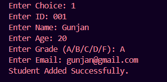

# Student Management System

## Project Overview

This is a console-based Student Management System developed as part of the WeIntern Java Developer Internship.

The application allows users to manage student records efficiently using CRUD (Create, Read, Update, Delete) operations. The project demonstrates the use of Java OOP concepts, Collections Framework, Enums, Exception Handling, and Input Validation.

---

# Features

✅ Add Student

✅ View All Students

✅ Search Student by ID

✅ Update Student Details

✅ Delete Student Records

✅ Input Validation

✅ Exception Handling

✅ Grade Management using Enum

✅ Menu-Driven Console Application

---

# Technologies Used

* Java
* ArrayList
* Enum
* OOP (Object-Oriented Programming)
* Exception Handling
* VS Code
* Git & GitHub

---

# Project Structure

```text
Task1_StudentManagementSystem/
│
├── images/
│   ├── menu.png
│   ├── add-student.png
│   ├── view-students.png
│   └── update-student.png
│
├── Grade.java
├── Student.java
├── StudentManagementSystem.java
└── README.md
```

---

# How to Run

## Step 1: Compile the Java Files

```bash
javac *.java
```

## Step 2: Run the Application

```bash
java StudentManagementSystem
```

---

# Sample Output

```text
=================================
    STUDENT MANAGEMENT SYSTEM
=================================
1. Add Student
2. View All Students
3. Search Student by ID
4. Update Student
5. Delete Student
6. Exit

Enter Choice:
```

---

# Application Menu


---

# Add Student



---

# View Students


---

# Update Student


---

# Input Validation

The application validates:

* Empty student names
* Invalid age values
* Duplicate student IDs
* Invalid grade entries
* Incorrect user inputs

---

# Test Scenarios

### Test Case 1: Add Student

**Input**

```text
1
101
Gunjan
20
A
gunjan@gmail.com
```

**Expected Output**

```text
Student Added Successfully.
```

---

### Test Case 2: Search Student

**Input**

```text
3
101
```

**Expected Output**

```text
ID: 101, Name: Gunjan, Age: 20, Grade: A, Email: gunjan@gmail.com
```

---

### Test Case 3: Delete Student

**Input**

```text
5
101
```

**Expected Output**

```text
Student Deleted Successfully.
```

---

# Learning Outcomes

Through this project, I learned:

* Java OOP Concepts
* CRUD Operations
* ArrayList Usage
* Enum Implementation
* Exception Handling
* Input Validation
* Git & GitHub Workflow

---

# Author

Gunjan
