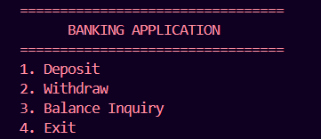
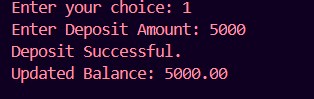
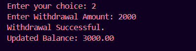
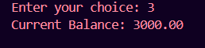

# Banking Application

## Project Overview

This is a console-based Banking Application developed as part of the WeIntern Java Developer Internship.

The application simulates basic banking operations such as depositing money, withdrawing money, and checking account balance. The project focuses on Java class design, method implementation, input validation, exception handling, and object-oriented programming principles.

---

# Features

✅ Deposit Money

✅ Withdraw Money

✅ Balance Inquiry

✅ Menu-Driven Console Application

✅ Input Validation

✅ Exception Handling

✅ Overdraft Protection

✅ User-Friendly Messages

---

# Technologies Used

* Java
* Object-Oriented Programming (OOP)
* Exception Handling
* Scanner Class
* VS Code
* Git & GitHub

---

# Project Structure

```text
Task2_BankingApplication/
│
├── images/
│   ├── menu.png
│   ├── deposit.png
│   ├── withdraw.png
│   └── balance.png
│
├── BankAccount.java
├── BankingApp.java
├── Main.java
└── README.md
```

---

# Class Responsibilities

| Class       | Responsibility                                 |
| ----------- | ---------------------------------------------- |
| BankAccount | Stores balance and performs account operations |
| BankingApp  | Handles menu logic and user interaction        |
| Main        | Starts the application                         |

---

# How to Run

## Step 1: Compile the Java Files

```bash
javac *.java
```

## Step 2: Run the Application

```bash
java Main
```

---

# Application Menu

```text
=================================
      BANKING APPLICATION
=================================
1. Deposit
2. Withdraw
3. Balance Inquiry
4. Exit

Enter your choice:
```

---

# Screenshots

## Main Menu



---

## Deposit Operation



---

## Withdraw Operation



---

## Balance Inquiry



---

# Core Operations

## Deposit

The deposit operation:

* Accepts positive amounts only
* Updates the account balance
* Displays the updated balance
* Rejects invalid or negative values

### Example

```text
Enter Deposit Amount: 5000

Deposit Successful.
Updated Balance: 5000.00
```

---

## Withdraw

The withdrawal operation:

* Accepts positive amounts only
* Checks available balance
* Prevents overdraft attempts
* Displays appropriate messages

### Example

```text
Enter Withdrawal Amount: 2000

Withdrawal Successful.
Updated Balance: 3000.00
```

---

## Balance Inquiry

Displays the current balance in a user-friendly format.

### Example

```text
Current Balance: 3000.00
```

---

# Exception Handling

The application handles:

### Invalid Numeric Input

```text
Invalid input. Please enter a numeric value.
```

### Negative Deposit

```text
Deposit amount must be positive.
```

### Negative Withdrawal

```text
Withdrawal amount must be positive.
```

### Insufficient Funds

```text
Insufficient Funds.
```

### Invalid Menu Choice

```text
Invalid Choice.
```

---

# Test Scenarios

## Test Case 1: Successful Deposit

**Input**

```text
1
5000
```

**Expected Output**

```text
Deposit Successful.
Updated Balance: 5000.00
```

---

## Test Case 2: Successful Withdrawal

**Input**

```text
2
2000
```

**Expected Output**

```text
Withdrawal Successful.
Updated Balance: 3000.00
```

---

## Test Case 3: Insufficient Balance

**Input**

```text
2
10000
```

**Expected Output**

```text
Insufficient Funds.
```

---

## Test Case 4: Invalid Input

**Input**

```text
abc
```

**Expected Output**

```text
Invalid input. Please enter a numeric value.
```

---

# Design Principles Used

* Encapsulation using private balance field
* Separation of concerns using multiple classes
* Input validation before processing
* Exception handling for runtime errors
* Clean and maintainable code structure

---

# Learning Outcomes

Through this project, I learned:

* Java Class Design
* Method Implementation
* Exception Handling
* Input Validation
* Menu-Driven Application Development
* Object-Oriented Programming
* Git & GitHub Workflow

---

# Author

**Gunjan**

Java Developer Intern
