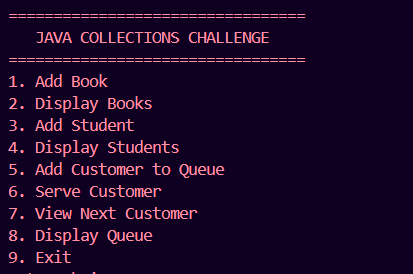
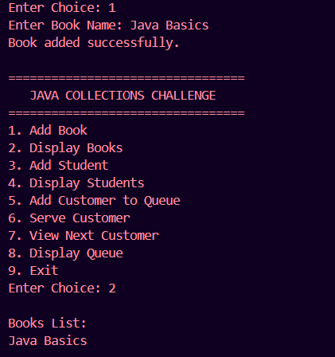
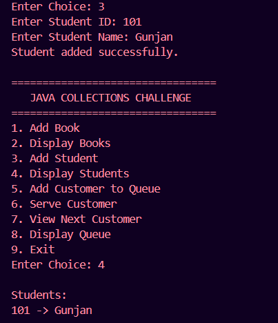
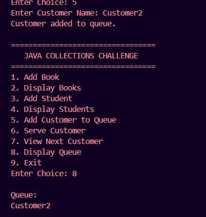
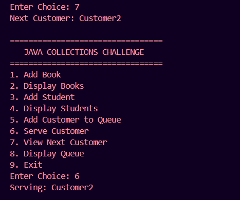

# Java Collections Challenge

## Project Overview

This is a console-based Java Collections Challenge developed as part of the WeIntern Java Developer Internship.

The project demonstrates the practical use of Java Collections Framework including:

- ArrayList for managing a dynamic list of books
- HashMap for storing student records
- Queue for handling customer service requests in FIFO order

The application uses a menu-driven interface and showcases common collection operations such as add, remove, update, search, iteration, insertion, retrieval, and queue processing.

---

# Features

## ArrayList Challenge

✅ Add Book

✅ Remove Book

✅ Update Book

✅ Search Book

✅ Display All Books

---

## HashMap Challenge

✅ Add Student

✅ Retrieve Student by ID

✅ Update Student Information

✅ Check Student Existence

✅ Display All Students

---

## Queue Challenge

✅ Add Customer to Queue

✅ Serve Customer (FIFO)

✅ View Next Customer

✅ Display Queue

---

# Technologies Used

- Java
- ArrayList
- HashMap
- Queue
- LinkedList
- Object-Oriented Programming (OOP)
- VS Code
- Git & GitHub

---

# Project Structure

```text
Task3_JavaCollectionsChallenge/
│
├── images/
│   ├── menu.png
│   ├── arraylist-output.png
│   ├── hashmap-output.png
│   └── queue-output.png
│
├── CollectionsManager.java
├── Main.java
└── README.md
```

---

# How to Run

## Step 1: Compile the Java Files

```bash
javac *.java
```

## Step 2: Run the Application

```bash
java Main
```

---

# Application Menu

```text
=================================
   JAVA COLLECTIONS CHALLENGE
=================================
1. Add Book
2. Display Books
3. Add Student
4. Display Students
5. Add Customer to Queue
6. Serve Customer
7. View Next Customer
8. Display Queue
9. Exit
```

---

# Screenshots

## Main Menu



---

## ArrayList Operations



---

## HashMap Operations



---

## Queue Operations





---

# Sample Execution

## ArrayList Example

### Input

```text
1
Java Basics
```

### Output

```text
Book added successfully.
```

### Display Books

```text
Books List:
Java Basics
```

---

## HashMap Example

### Input

```text
3
101
Gunjan
```

### Output

```text
Student added successfully.
```

### Display Students

```text
Students:
101 -> Gunjan
```

---

## Queue Example

### Input

```text
5
Customer1
```

```text
5
Customer2
```

### Display Queue

```text
Queue:
Customer1
Customer2
```

### Peek Customer

```text
Next Customer: Customer1
```

### Serve Customer

```text
Serving: Customer1
```

---

# Collections Used

## ArrayList

Used for:

- Dynamic book storage
- Ordered data management
- Easy iteration and updates

Example:

```java
ArrayList<String> books = new ArrayList<>();
```

---

## HashMap

Used for:

- Fast key-value lookup
- Student ID and Name mapping

Example:

```java
HashMap<Integer, String> students = new HashMap<>();
```

---

## Queue

Used for:

- First-In-First-Out (FIFO) processing
- Customer service simulation

Example:

```java
Queue<String> customers = new LinkedList<>();
```

---

# Learning Outcomes

Through this project, I learned:

- Java Collections Framework
- ArrayList Operations
- HashMap Operations
- Queue Implementation
- Iteration Techniques
- Menu-Driven Application Development
- Object-Oriented Programming
- Git & GitHub Workflow

---

# Best Practices Followed

- Meaningful class and method names
- Proper indentation and formatting
- Encapsulation and OOP principles
- Clean and readable code
- Separation of responsibilities
- User-friendly output messages

---

# Author

**Gunjan**

Java Developer Intern