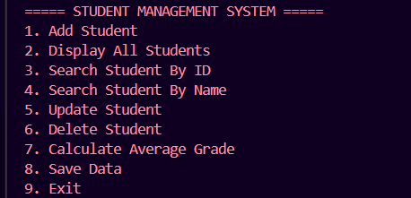
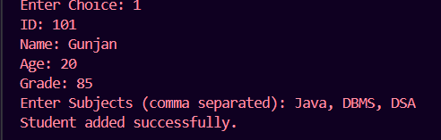
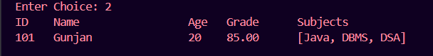
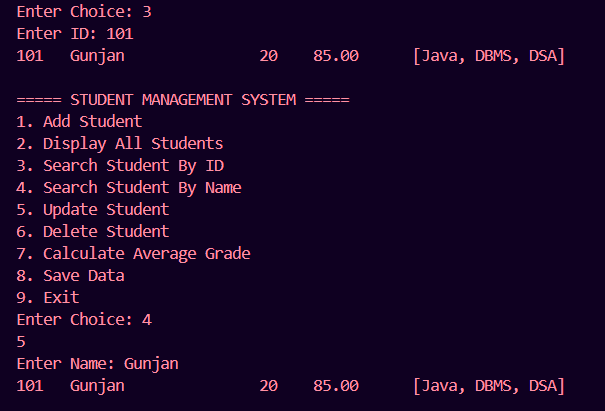
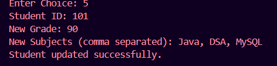
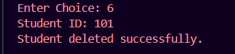
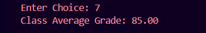

# Student Management System

## Project Overview

This is a console-based Student Management System developed as part of the WeIntern Java Developer Internship - Week 2.

The application allows users to manage student records efficiently using CRUD operations. It demonstrates Java Object-Oriented Programming (OOP), Collections Framework, File Handling, Input Validation, and Menu-Driven Application Development.

---

# Objective

Build a system to:

* Add student records
* Display all students
* Search students by ID or Name
* Update student details
* Delete student records
* Calculate class average grades
* Save and load data using file persistence

---

# Features Implemented

✅ Add New Student

✅ Display All Students

✅ Search Student by ID

✅ Search Student by Name (Case-Insensitive)

✅ Update Student Grade and Subjects

✅ Delete Student Record

✅ Calculate Class Average Grade

✅ File Persistence (Save & Load Data)

✅ Menu-Driven Console Interface

✅ Input Validation

---

# Technologies Used

| Technology     | Purpose                        |
| -------------- | ------------------------------ |
| Java 11+       | Programming Language           |
| ArrayList      | Store Student Records          |
| Scanner        | User Input                     |
| Object Streams | Data Persistence               |
| OOP            | Encapsulation and Class Design |
| VS Code        | Development Environment        |
| Git & GitHub   | Version Control                |

---

# Project Structure

```text
Week2_Task1_StudentManagementSystem/
│
├── Student.java
├── StudentManager.java
├── Main.java
├── students.txt
├── README.md
│
└── images/
    ├── menu.png
    ├── add-student.png
    ├── display-students.png
    ├── search-student.png
    ├── update-student.png
    ├── delete-student.png
    └── average-grade.png
```

---

# Class Responsibilities

## Student

Stores student information:

* Student ID
* Name
* Age
* Grade
* Subjects

---

## StudentManager

Handles:

* Add Student
* Search Student
* Update Student
* Delete Student
* Calculate Average Grade
* Save Data
* Load Data

---

## Main

Responsible for:

* Menu Display
* User Interaction
* Calling StudentManager Methods

---

# How to Compile and Run

## Compile

```bash
javac *.java
```

## Run

```bash
java Main
```

---

# Application Menu

```text
===== STUDENT MANAGEMENT SYSTEM =====

1. Add Student
2. Display All Students
3. Search Student By ID
4. Search Student By Name
5. Update Student
6. Delete Student
7. Calculate Average Grade
8. Save Data
9. Exit
```

---

# Screenshots

## Main Menu



---

## Add Student



---

## Display Students



---

## Search Student



---

## Update Student



---

## Delete Student



---

## Average Grade Calculation



---

# Sample Execution

## Add Student

### Input

```text
1
101
Gunjan
20
85
Java, DBMS, DSA
```

### Output

```text
Student added successfully.
```

---

## Display Students

### Output

```text
ID    Name                 Age   Grade      Subjects
101   Gunjan               20    85.00      [Java, DBMS, DSA]
```

---

## Search Student

### Input

```text
3
101
```

### Output

```text
101   Gunjan   20   85.00   [Java, DBMS, DSA]
```

---

## Update Student

### Input

```text
5
101
90
Java, DSA, MySQL
```

### Output

```text
Student updated successfully.
```

---

## Delete Student

### Input

```text
6
101
```

### Output

```text
Student deleted successfully.
```

---

## Calculate Average Grade

### Output

```text
Class Average Grade: 88.50
```

---

# UML Class Diagram

```text
+------------------+
|     Student      |
+------------------+
| id               |
| name             |
| age              |
| grade            |
| subjects         |
+------------------+

          |

          v

+------------------+
| StudentManager   |
+------------------+
| addStudent()     |
| displayAll()     |
| searchById()     |
| searchByName()   |
| updateStudent()  |
| deleteStudent()  |
| calculateAverage()|
| saveToFile()     |
| loadFromFile()   |
+------------------+

          |

          v

+------------------+
|      Main        |
+------------------+
| menu()           |
| userInput()      |
+------------------+
```

---

# Key Concepts Demonstrated

* Object-Oriented Programming (OOP)
* Encapsulation
* ArrayList Collection
* File Handling
* Serialization
* CRUD Operations
* Input Validation
* Exception Handling
* Menu-Driven Applications

---

# Learning Outcomes

Through this project, I learned:

* Designing Java Classes
* Managing Data with ArrayList
* Implementing CRUD Operations
* Working with File Persistence
* Handling User Input
* Building Menu-Driven Applications
* Git & GitHub Workflow

---

# Author

**Gunjan**

Java Developer Intern – WeIntern
