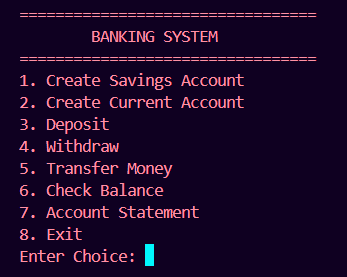
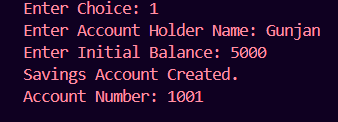
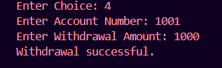
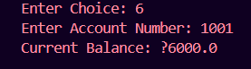
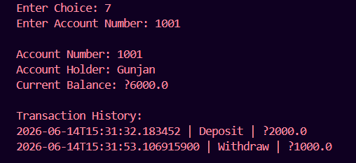

# Banking System

## Project Overview

This is a console-based Banking System developed as part of the WeIntern Java Developer Internship - Week 2.

The application simulates real-world banking operations using Object-Oriented Programming concepts such as Inheritance, Polymorphism, Abstraction, and Exception Handling.

The system supports multiple account types, transaction management, balance inquiries, money transfers, and account statements.

---

# Objective

Build a banking system that allows users to:

- Create Savings and Current Accounts
- Deposit Money
- Withdraw Money
- Transfer Funds
- View Account Balance
- View Transaction History
- Generate Account Statements
- Enforce Banking Business Rules

---

# Features Implemented

## Account Management

✅ Create Savings Account

✅ Create Current Account

✅ Auto-Generated Account Numbers

---

## Banking Operations

✅ Deposit Funds

✅ Withdraw Funds

✅ Transfer Money Between Accounts

✅ Balance Inquiry

✅ Account Statement Generation

---

## Transaction Management

✅ Transaction History Logging

✅ Date and Time Tracking

✅ Deposit Records

✅ Withdrawal Records

---

## Business Rules

✅ Positive Amount Validation

✅ Insufficient Funds Check

✅ Savings Account Minimum Balance Rule

✅ Account Existence Validation

---

## OOP Concepts Used

✅ Abstraction

✅ Inheritance

✅ Polymorphism

✅ Encapsulation

✅ Method Overriding

---

# Technologies Used

| Technology | Purpose |
|------------|---------|
| Java 11+ | Programming Language |
| HashMap | Account Management |
| ArrayList | Transaction History |
| OOP | System Design |
| Scanner | User Input |
| VS Code | Development Environment |
| Git & GitHub | Version Control |

---

# Project Structure

```text
Week2_Task2_BankingSystem/
│
├── Transaction.java
├── BankAccount.java
├── SavingsAccount.java
├── CurrentAccount.java
├── Bank.java
├── Main.java
├── README.md
│
└── images/
    ├── menu.png
    ├── create-account.png
    ├── deposit.png
    ├── withdraw.png
    ├── transfer.png
    ├── balance.png
    └── statement.png
```

---

# Class Responsibilities

## Transaction

Stores:

- Transaction Type
- Amount
- Date and Time

---

## BankAccount (Abstract Class)

Defines common account functionality:

- Deposit
- Withdraw (abstract)
- Balance Management
- Transaction History

---

## SavingsAccount

Implements:

- Minimum Balance Rule
- Savings Withdrawal Logic

---

## CurrentAccount

Implements:

- Standard Withdrawal Logic
- Overdraft Prevention

---

## Bank

Handles:

- Account Creation
- Account Search
- Money Transfer
- Account Storage using HashMap

---

## Main

Responsible for:

- Menu Display
- User Interaction
- Calling Banking Operations

---

# UML Class Diagram

```text
                   +----------------+
                   | Transaction    |
                   +----------------+
                   | type           |
                   | amount         |
                   | dateTime       |
                   +----------------+

                           ▲

                           |

                   +----------------+
                   | BankAccount    |
                   | (Abstract)     |
                   +----------------+
                   | accountNumber  |
                   | holderName     |
                   | balance        |
                   +----------------+
                   | deposit()      |
                   | withdraw()     |
                   | statement()    |
                   +----------------+

                    ▲          ▲
                    |          |

      +----------------+   +----------------+
      | SavingsAccount |   | CurrentAccount |
      +----------------+   +----------------+
      | withdraw()     |   | withdraw()     |
      +----------------+   +----------------+

                    ▲
                    |
            +---------------+
            |     Bank      |
            +---------------+
            | HashMap       |
            | transfer()    |
            | createAcc()   |
            +---------------+

                    ▲
                    |
            +---------------+
            |     Main      |
            +---------------+
```

---

# How to Compile and Run

## Compile

```bash
javac *.java
```

## Run

```bash
java Main
```

---

# Application Menu

```text
=================================
        BANKING SYSTEM
=================================
1. Create Savings Account
2. Create Current Account
3. Deposit
4. Withdraw
5. Transfer Money
6. Check Balance
7. Account Statement
8. Exit
```

---

# Screenshots

## Main Menu



---

## Create Account



---

## Deposit Operation

.png)

---

## Withdraw Operation



---

## Balance Inquiry



---

## Account Statement



---

# Sample Execution

## Create Savings Account

### Input

```text
1
Gunjan
5000
```

### Output

```text
Savings Account Created.
Account Number: 1001
```

---

## Deposit

### Input

```text
3
1001
2000
```

### Output

```text
Deposit successful.
```

---

## Withdraw

### Input

```text
4
1001
1000
```

### Output

```text
Withdrawal successful.
```

---

## Transfer Funds

### Input

```text
5
1001
1002
500
```

### Output

```text
Transfer successful.
```

---

## Balance Inquiry

### Input

```text
6
1001
```

### Output

```text
Current Balance: ₹5500.0
```

---

## Account Statement

### Output

```text
Account Number: 1001
Account Holder: Gunjan
Current Balance: ₹5500.0

Transaction History:

2026-xx-xx | Deposit | ₹2000.0
2026-xx-xx | Withdraw | ₹1000.0
2026-xx-xx | Transfer | ₹500.0
```

---

# Exception Handling

The application handles:

### Invalid Deposit Amount

```text
Invalid amount.
```

### Invalid Withdrawal Amount

```text
Invalid amount.
```

### Insufficient Funds

```text
Insufficient funds.
```

### Minimum Balance Violation

```text
Minimum balance rule violated.
```

### Account Not Found

```text
Account not found.
```

---

# Key Concepts Demonstrated

- Abstract Classes
- Inheritance
- Polymorphism
- Encapsulation
- HashMap Collections
- ArrayList Collections
- Transaction Management
- Business Rule Enforcement
- Menu-Driven Applications

---

# Learning Outcomes

Through this project, I learned:

- Designing Banking Systems
- Using Inheritance and Polymorphism
- Managing Transactions
- Working with HashMap and ArrayList
- Implementing Business Rules
- Building Scalable Java Applications
- Git & GitHub Workflow

---

# Author

**Gunjan**

Java Developer Intern – WeIntern